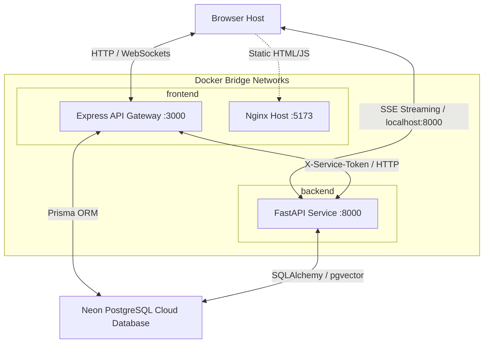
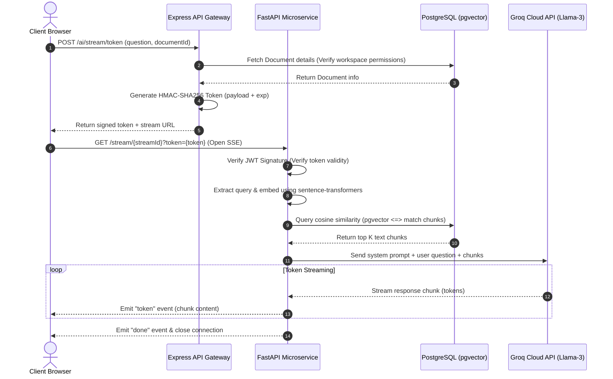
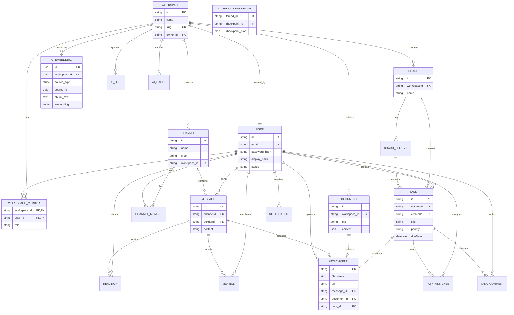

# TeamHub — Enterprise-Grade Workspace Collaboration Platform

<p align="center">
  
  
  
  
  
  
  
  
  
  
  
  
  
  
</p>

TeamHub is a high-performance, containerized monorepo platform designed for team coordination, document knowledge-base building, and automated project workflows. It integrates real-time team collaboration with state-of-the-art state machine AI agents to scan specifications, run workload-constrained auto-assignment loops, and search documents semantically.

---

## 📖 Table of Contents
1. [🚀 Key Features](#-key-features)
2. [🛠️ Tech Stack](#️-tech-stack)
3. [📁 Folder Structure](#-folder-structure)
4. [🏗️ System Architecture](#️-system-architecture)
5. [⚙️ Environment Variables](#️-environment-variables)
6. [🏃 Running Locally (No Docker)](#-running-locally-no-docker)
7. [🐳 Running with Docker (Production/Staging)](#-running-with-docker-productionstaging)
8. [🔐 Default Test Credentials](#-default-test-credentials)
9. [🔌 API Endpoints Summary](#-api-endpoints-summary)
10. [👥 Developer Experience & Contribution](#-developer-experience--contribution)
11. [👥 Team Distribution](#-team-distribution)

---

## 🚀 Key Features

### 🔐 User & Security Features
* **Unified Auth System**: Secure authentication utilizing password hashing via `bcrypt` and JWT session management. Features a stateless short-lived `access_token` and secure `httpOnly` cookie-stored `refresh_token` with automatic Token Rotation to defend against replay attacks.
* **Granular Role-Based Access Control (RBAC)**: Fine-grained workspace permission checking (Owner, Admin, Member, Guest) dynamically restricting editing rights on documents, channel management, and task updates.
* **Premium Profile Settings**: Flexible workspace membership directories displaying display names, statuses, and custom abstract avatars generated via DiceBear APIs.

### 📋 Real-Time Work Management (Kanban Boards)
* **Live Interactive Kanban**: Create project boards to separate departments or sprints. Column layouts support vertical scrolling on desktop, custom drag-and-drop actions, and a mobile tabbed "Focus Mode" to prevent cramped viewports.
* **Deep-Linked Task Cards**: Task details open in a right-side sliding panel and automatically append the task ID to the browser URL (e.g. `?task=uuid`), allowing direct link sharing.
* **Rich Task Metadata & Colleague Discussion**: Set due dates (with red overdue highlight states), priorities (Low, Medium, High, Urgent), and multiple user assignees. Discuss deliverables via real-time threaded message streams.
* **Smart Filter & Commands Header**: Instantly search tasks by text or isolate items by priority, assignment, or dates (Today, This Week, Overdue) with drag-and-drop locks when filters are active.

### 💬 Workspace Messaging & Channels
* **Dynamic Chat Rooms**: Supports creating public channels (which users can join/leave directly), private channels, and direct messages (DMs).
* **Optimistic UI & WebSocket Sync**: Socket.io broadcasting ensures messages, typing indicators, and emoji reactions update instantly. Message delivery displays immediately in the viewport while database writes execute in the background.

### 📄 Document Hub & Rich Text Editor
* **TipTap Collaborative Editor**: Interactive document workspace supporting header hierarchies, nested formatting, code snippets, lists, checkboxes, and links.
* **Debounced Auto-Save**: Seamless background synchronization saves content modifications as you write to prevent data loss.
* **Exporting Frameworks**: Exporters include a recursive JSON-to-Markdown parser producing clean GitHub-Flavored Markdown and a client-side print-friendly PDF engine which overrides dark-mode settings to produce light, clean documents.

### 🤖 State Machine AI Agents (FastAPI & LangGraph)
* **Retrieval-Augmented Generation (RAG)**: An isolated FastAPI microservice processes document text, splits content into overlapping chunks, computes embeddings via HuggingFace `all-MiniLM-L6-v2`, and stores them in PostgreSQL using the `pgvector` extension.
* **Document Q&A & Summaries**: Stream answers grounded in your workspace database or run summaries (Short, Medium, Long) with low-latency Server-Sent Events (SSE).
* **Document-to-Tasks Extraction Agent**: Extracts draft checklist items from document nodes, flags vague timelines/descriptions, prompts clarification workflows via LangGraph `interrupt()`, and maps workspace members automatically.
* **Workload-Constrained Auto-Assignment Agent**: Automatically schedules unassigned tasks by calculating member workloads (Low: 1pt, Urgent: 5pts), runs optimization loops to balance workloads, and renders current vs. proposed point capacity charts for approval.
* **Global Command Palette (`Ctrl + K`)**: Summon a workspace-wide search console to perform semantic queries across all doc libraries.

---

## 🛠️ Tech Stack

### Frontend Client
* **Core Framework**: React (Vite SPA)
* **Styling & Icons**: Tailwind CSS, Lucide Icons
* **Rich Text Editing**: TipTap Editor (ProseMirror-based)
* **Real-time & Sync**: TanStack Query v5, Socket.io-client, Zustand (Global state persistence)
* **Exporting Tools**: `html2pdf.js`

### Backend Gateway
* **Core Engine**: Node.js, Express.js (TypeScript)
* **ORM & Database**: Prisma Client v7, PostgreSQL
* **Security & Routing**: Helmet, `cookie-parser`, `bcrypt`, JSON Web Tokens
* **Real-time Server**: Socket.io

### AI Microservice
* **Framework**: FastAPI (Python 3.11)
* **Database Interface**: SQLAlchemy, Asyncpg, Alembic migrations
* **AI & Graph Agent Engine**: LangGraph, LangChain, Groq Cloud API (Llama models)
* **Embeddings & Search**: HuggingFace SentenceTransformers (`all-MiniLM-L6-v2`), PostgreSQL `pgvector`

---

## 📁 Folder Structure

```
teamhub/
├── apps/
│   ├── ai/                  # Python FastAPI Microservice (LangGraph, Alembic, Embeddings)
│   │   ├── app/             # Routers, schemas, agents, and embedding pipelines
│   │   └── alembic/         # Database migration versions
│   ├── api/                 # Node.js/Express API Gateway (Auth, WebSockets, Prisma)
│   │   ├── prisma/          # Schema definitions, database seed files, and migrations
│   │   └── src/             # Express features, routers, middleware, and controllers
│   └── web/                 # React + Vite Frontend Client
│       └── src/             # Components, hooks, Zustand stores, and routing
├── packages/
│   ├── shared/              # Centralized workspace (Zod schemas, shared TypeScript types)
│   ├── eslint-config/       # ESLint configurations
│   └── typescript-config/   # Centralized TSConfigs (base.json, etc.)
├── docs/                    # Individual feature documentation files
├── docker-compose.yml       # Docker orchestrator configuration
├── pnpm-workspace.yaml      # Monorepo workspaces definition
└── turbo.json               # Turborepo task pipeline management
```

---

## 🏗️ System Architecture

TeamHub uses an API Gateway architecture with isolated networks to guarantee security:

### Network Topology & Request Routing


### AI RAG & EventSource Streaming Sequence
This sequence details how the EventSource streaming query resolves from authentication, chunk matching, to token delivery:


### PostgreSQL Database Schema (ER Diagram)
Below is the database entity relationship mapping displaying relational tables and the vector store schemas:


---

## ⚙️ Environment Variables

Copy the templates from the repository root (`docker.env.example` or service directories) to create your configurations.

### Database Settings
* `DATABASE_URL`: Prisma connection string (PostgreSQL) pointing to your Neon database.
* `DATABASE_URL_AI`: Async-compatible SQLAlchemy database connection URL (e.g. `postgresql+asyncpg://...`).

### Authentication Secrets
* `JWT_ACCESS_SECRET`: Private signing key for temporary access tokens.
* `JWT_REFRESH_SECRET`: Private signing key for HttpOnly refresh tokens.
* `JWT_ACCESS_EXPIRES`: Expiration duration for session access (e.g., `15m`).
* `JWT_REFRESH_EXPIRES`: Expiration duration for session refresh (e.g., `7d`).

### AI Microservice Configs
* `GROQ_API_KEY`: API key for Groq Cloud (runs the Llama-3 text generators).
* `AI_SERVICE_TOKEN`: Secret key for Express-to-FastAPI service headers.
* `AI_SERVICE_URL`: Internal URL for the API to contact the AI service (`http://ai:8000` in Docker).
* `AI_SERVICE_URL_EXTERNAL`: Public URL for the browser to connect to the SSE streams (`http://localhost:8000`).

### Asset Storage
* `CLOUDINARY_CLOUD_NAME`: Media storage Cloud Name.
* `CLOUDINARY_API_KEY`: Media storage Api Key.
* `CLOUDINARY_API_SECRET`: Media storage Api Secret.

---

## 🏃 Running Locally (No Docker)

### 1. Prerequisites
* **Node.js** (v18+) & **pnpm** (v9+)
* **Python** (v3.11+)
* **PostgreSQL** instance (ensure the `pgvector` extension is enabled on your DB server)

### 2. Setup Guide

#### **Step 1: Install Node.js Dependencies**
From the root directory, install the monorepo packages:
```bash
pnpm install
```

#### **Step 2: Configure Environment Variables**
Copy `.env.example` configurations in the respective directories to `.env`:
* Copy `.env.example` to `.env` in the root.
* Copy `apps/api/.env.example` to `apps/api/.env`.
* Copy `apps/ai/.env.example` to `apps/ai/.env`.

#### **Step 3: Setup Python Virtual Environment**
Create and install the FastAPI package inside the virtual environment:
```bash
cd apps/ai
python -m venv .venv

# Activate (Windows PowerShell):
.venv\Scripts\Activate.ps1
# Activate (Linux/macOS):
source .venv/bin/activate

pip install -e ".[dev]"
cd ../..
```

#### **Step 4: Run Database Migrations**
Apply Prisma tables and Alembic vector tables:
```bash
# Apply Relational DB Migrations:
pnpm prisma:migrate

# Apply AI Alembic Migrations:
cd apps/ai
alembic upgrade head
cd ../..
```

#### **Step 5: Launch the Development Servers**
Start all three microservices concurrently using a single command:
```bash
pnpm dev
```
Once started:
* **Frontend Web App**: http://localhost:5173
* **API Gateway Server**: http://localhost:3000
* **FastAPI Docs**: http://localhost:8000/docs

---

## 🐳 Running with Docker (Production/Staging)

A multi-stage production layout is configured using Docker Compose. Front-facing traffic is isolated from internal databases and Python execution paths.

### 1. Prerequisites
* **Docker Engine** (v20+)
* **Docker Compose** (v2+)

### 2. Execution Commands

#### **Build and Start Container Services**
Make sure your root `.env` has all configurations populated, then run:
```bash
docker compose up --build
```
On startup:
1. The `api` container runs database migrations (`prisma migrate deploy`) and starts.
2. The `ai` and `web` containers wait for the `api` service to pass health checks.
3. The `ai` container applies Alembic migrations (`alembic upgrade head`) and starts Uvicorn.
4. The `web` container serves minified assets through Nginx.

#### **Stop and Clean Containers**
To stop the services and release ports:
```bash
docker compose down
```

To permanently remove volumes (clears local state, does not affect Neon databases):
```bash
docker compose down -v
```

## 🔐 Default Test Credentials

For quick local evaluation, you can bypass user registration by authenticating with the default pre-seeded user profile:

* **Email Address**: `e2etester@gmail.com`
* **Password**: `password123`
* **Pre-loaded Workspace**: Contains pre-configured task boards, document nodes, channels, and message history.

---

## 🔌 API Endpoints Summary

All routes (except Auth) require a valid JWT token passed in the `Authorization: Bearer <token>` header.

### 🔐 Authentication (`/auth`)
* `POST /auth/register` - Create workspace user profiles
* `POST /auth/login` - Authenticates user and issues access/refresh tokens
* `POST /auth/refresh` - Issues new access/refresh tokens
* `POST /auth/logout` - Revokes session tokens

### 👥 Workspace & Members (`/workspaces`)
* `GET /workspaces` - Retrieve user workspaces
* `POST /workspaces` - Create new team workspaces
* `GET /workspaces/:workspaceId/members` - List workspace colleagues
* `POST /workspaces/:workspaceId/members` - Invite colleagues
* `PATCH /workspaces/:workspaceId/members/:userId` - Update user permission roles

### 💬 Channels & Messaging (`/channels` & `/messages`)
* `GET /channels/:workspaceId` - List available workspace chat rooms
* `POST /channels/:workspaceId` - Create text/private channels or DMs
* `GET /channels/:workspaceId/:channelId/messages` - Retrieve paginated messages
* `POST /channels/:workspaceId/:channelId/messages` - Send messages

### 🤖 AI microservice Proxy (`/ai`)
* `POST /ai/documents/:documentId/qa` - Submit Q&A queries
* `POST /ai/documents/:documentId/summarize` - Summarize documents
* `POST /ai/documents/:documentId/generate-tags` - Extract tags
* `POST /ai/stream/token` - Requests a signed SSE token to open an EventSource stream

---

## 👥 Developer Experience & Contribution

### Available Scripts
Manage your development workflow from the root directory:
* `pnpm build`: Builds all monorepo workspaces (shared packages, client, server)
* `pnpm dev`: Launches concurrent development pipelines with hot-reload
* `pnpm check-types`: Runs static type verification checks across the codebase
* `pnpm lint`: Audits formatting and code style guidelines

### Contribution Guide
1. Create a feature branch (`git checkout -b feat/your-feature`).
2. Run validation checks locally (`pnpm lint` and `pnpm check-types`).
3. Deploy changes to your staging environment using `docker compose up --build`.
4. Commit your work using conventional commit messages and submit a Pull Request.

---

## 👥 Team Distribution

| Team Member | Ownership Area | Key Contributions / Delivered Features |
| :--- | :--- | :--- |
| **Mazen Raafat** | Core Auth & Workspace Foundation | <ul><li>**Unified Auth System**: registration, login with `bcrypt` encryption, JWT token management, and secure `httpOnly` cookie refresh token rotation.</li><li>**Workspace Management**: complete workspace CRUD operations, strict name and slug validation, and owner auto-assignment.</li><li>**User Profile**: dedicated me-endpoints supporting profile updates and Premium DiceBear avatar integration.</li><li>**Workspace validation schemas**: Centralized Zod types and interfaces shared in the monorepo.</li></ul> |
| **Hassan Muhammad** | Workspace Members & Channels | <ul><li>**Workspace Directory**: search and listing views, add-member actions, RBAC restrictions, and toast feedback alerts.</li><li>**Channels Workspace**: details pages, non-DM member lists, and public channel self-join mechanisms.</li><li>**Direct Messages Flow**: transactional DM instantiation creating channel and participant relationships simultaneously, and search integration.</li><li>**Express API Endpoints**: user search, workspace members endpoints, and channel CRUD functions.</li></ul> |
| **Moamen Soltan** | Real-Time Chat & Messages | <ul><li>**Real-Time Messaging**: WebSocket delivery, cursor-based message pagination, and Socket.io typing indicators.</li><li>**Message Alignment UI**: customized peer vs self chat bubble layout positioning (right-aligned accent colors vs left-aligned avatar bubbles).</li><li>**Schema Design**: database setup of Message, Reactions, Mentions, and Attachments models.</li></ul> |
| **Shawky Elsayed** | Work Management & Boards | <ul><li>**Kanban Board UI**: horizontal column layout, mobile "Focus Mode" tabs switcher, and statistics header widgets.</li><li>**Task Cards**: drag-and-drop actions, priority indicators, assignee avatars, and due date overdue highlight flags.</li><li>**Task Detail Sliding Panel**: sliding detail drawer and browser URL deep-linking support (`?task=uuid`).</li><li>**Real-Time Sync**: Socket-powered synchronization ensuring board states remain updated.</li></ul> |
| **Hassan Abdelhamed** | Document Hub, Assets & AI | <ul><li>**Document Workspace**: CRUD lifecycle, TipTap editor layout, Cover & Icon pickers, and debounced auto-saves.</li><li>**Document Exporters**: custom Markdown parser and theme-agnostic light mode PDF print exporter.</li><li>**Media Attachment System**: Cloudinary uploads mapping uploads to a single target constraint (docs, chat, tasks).</li><li>**Notification Center**: persistent db alerts for workspace invites, mentions, and assignments.</li><li>**AI & RAG Engine**: FastAPI Python service, semantic embeddings pipeline (SentenceTransformers + pgvector), global command palette search (`Ctrl+K`), Q&A (RAG), and streaming SSE summaries.</li><li>**Stateful Agent Workflows**: LangGraph task extractor with HITL steppers, workload capacity point rebalancing loops, and SQLAlchemy thread checkpointer.</li></ul> |
