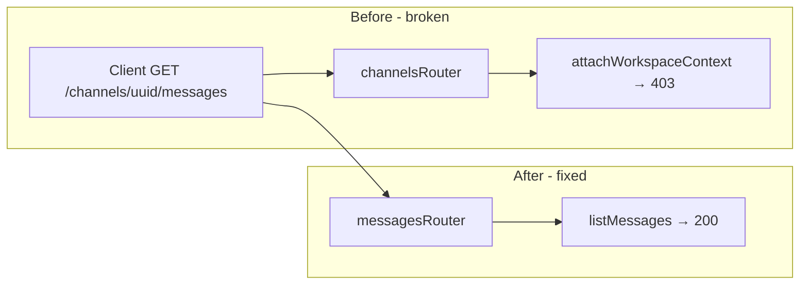

# Messaging Fixes — Implementation Notes

**Date:** May 2026  
**Scope:** Fix GET `403`, POST `500`, DM display names, and chat bubble alignment.

---

## Summary

| Issue | Symptom | Root cause | Fix |
|-------|---------|------------|-----|
| GET messages | `403 Forbidden` on `/channels/:id/messages` | Express route shadowing | Register `messagesRouter` before `channelsRouter` |
| POST message | `500 Internal Server Error` | `Message` tables missing in DB | Prisma migration `20260523120000_add_messages_and_attachments` |
| DM titles | Both users saw the same name (often the non-initiator’s own name) | Single `channel.name` set at create time | Server-side `resolveDmName()` per viewer |
| Message UI | All messages left-aligned | No own vs other logic | `MessageItem` uses `useAuthStore` for alignment |

Typing indicators worked before these fixes because Socket.IO does not enforce the same REST channel access checks.

---

## 1. GET 403 — Router registration order

### Problem

The web client calls:

```
GET /channels/{channelId}/messages?limit=30
```

Two routers mount on `/channels`:

- **channelsRouter:** `GET /:workspaceId/:channelId`
- **messagesRouter:** `GET /:channelId/messages`

With **channels registered first**, Express matched:

- `workspaceId` = channel UUID
- `channelId` = literal `"messages"`

That hit `attachWorkspaceContext`, which looked up workspace membership using the channel ID as a workspace ID → **403** (`Workspace not found or access denied`). The messages handler never ran.

POST sometimes worked because there was no conflicting `POST /:workspaceId/:channelId` on the channels router.

### Fix

**File:** `apps/api/src/appRouter.ts`

Register `messagesRouter` **before** `channelsRouter` on `/channels`, with a comment explaining why order matters.

```ts
// messagesRouter must be registered before channelsRouter — both match /channels/:id/messages
appRouter.use('/channels', messagesRouter);
appRouter.use('/channels', channelsRouter);
```

### Verification

- `GET /channels/{channelId}/messages` returns `200` with a paginated message list (or empty array).
- Response is not `"Workspace not found or access denied"`.

---

## 2. POST 500 — Database schema (Message tables)

### Problem

`schema.prisma` defined `Message`, `MessageReaction`, `MessageMention`, `MessageAttachment`, `Attachment`, and related models, but no migration had created them in PostgreSQL. `prisma.message.create` failed at runtime → **500**.

### Fix

**Migration:** `apps/api/prisma/migrations/20260523120000_add_messages_and_attachments/migration.sql`

Creates (among others):

- Enum `MessageType`
- Tables: `Message`, `MessageReaction`, `MessageMention`, `MessageAttachment`, `Attachment`
- Related enums/tables also in schema: `NotificationType`, `Notification`, `Document`, `Task`, join tables

### Applying on Neon / production

- Use **`npx prisma migrate deploy`** against the Neon `DATABASE_URL`.
- Avoid **`prisma migrate dev`** on shared Neon DBs (can prompt a full DB reset).
- After apply: `npx prisma generate` and restart the API.

### Verification

- `POST /channels/{channelId}/messages` with `{ "content": "hello" }` succeeds.
- Message row exists in the `Message` table.

---

## 3. DM display names — Viewer-specific labels

### Problem

On DM create, the client set `channel.name` to the **selected participant’s** display name. Both users read the same `name` from the API:

- Initiator saw the correct peer name.
- The other user often saw **their own** name.

### Fix

**File:** `apps/api/src/features/channels/channels.service.ts`

1. **`resolveDmName(members, viewerId, fallbackName)`**  
   For `type === 'dm'`, finds the channel member whose `user_id` is not the viewer and returns `display_name` or `email`.

2. **`listChannels`**  
   Includes all members with user profile (`channelMemberSelect`). For DMs, overrides `name` with `resolveDmName`. Strips raw `members` from the API payload.

3. **`getChannel`**  
   After access check, for DMs loads members and returns resolved `name`.

4. **`createChannel`**  
   When returning an existing or newly created DM, resolves `name` for the actor before responding.

No shared type changes required; the UI already uses `channel.name` on `DirectMessagesPage` and `ChannelPage`.

### Verification

- User A DMs User B → A’s list/header shows B’s name; B sees A’s name.

---

## 4. Message UI — Own vs other alignment

### Problem

**File:** `apps/web/src/features/messages/components/MessageItem.tsx`  
Every message used the same left-aligned row (avatar + content). `message.sender.id` was never compared to the logged-in user.

### Fix

- Import `useAuthStore`.
- `isOwn = message.sender?.id === currentUserId`.
- **Other:** left layout, avatar, sender name, plain text.
- **Own:** `flex-row-reverse`, `justify-end`, right-aligned bubble (`bg-primary-accent/20`), no avatar, max width ~75%.

Optimistic messages in `useMessages.ts` already attach `currentUser` as `sender`, so they align right immediately.

### Verification

- Sent messages appear on the right with accent bubble.
- Received messages on the left with avatar.

---

## Files changed

| File | Change |
|------|--------|
| `apps/api/src/appRouter.ts` | Messages router registered before channels router |
| `apps/api/prisma/migrations/20260523120000_add_messages_and_attachments/migration.sql` | New tables for messaging |
| `apps/api/src/features/channels/channels.service.ts` | `resolveDmName`, DM name in list/get/create |
| `apps/web/src/features/messages/components/MessageItem.tsx` | Own vs other layout |

**Unchanged (by design):**

- `apps/web/src/features/messages/api/messages.api.ts` — URLs stay `/channels/:channelId/messages`
- Socket typing — no membership guard added (optional follow-up)

---

## Architecture (before / after routing)



---

## Troubleshooting

| Symptom | Check |
|---------|--------|
| Still 403 on GET | Confirm `appRouter` order; restart API |
| Still 500 on POST | Confirm `Message` table exists on Neon; run `migrate deploy` |
| DM name still wrong | Hard refresh; refetch channels; confirm API returns resolved `name` |
| All messages on left | Logged-in user id must match `message.sender.id` |
| Tables missing after migrate | Do not use `migrate dev` on Neon without backup; prefer `migrate deploy` or Neon restore |

---

## Related endpoints

| Method | Path | Handler |
|--------|------|---------|
| GET | `/channels/:channelId/messages` | `MessagesController.listMessages` |
| POST | `/channels/:channelId/messages` | `MessagesController.createMessage` |
| GET | `/workspaces/:workspaceId/channels` (via channels API) | `listChannels` (DM names resolved) |
